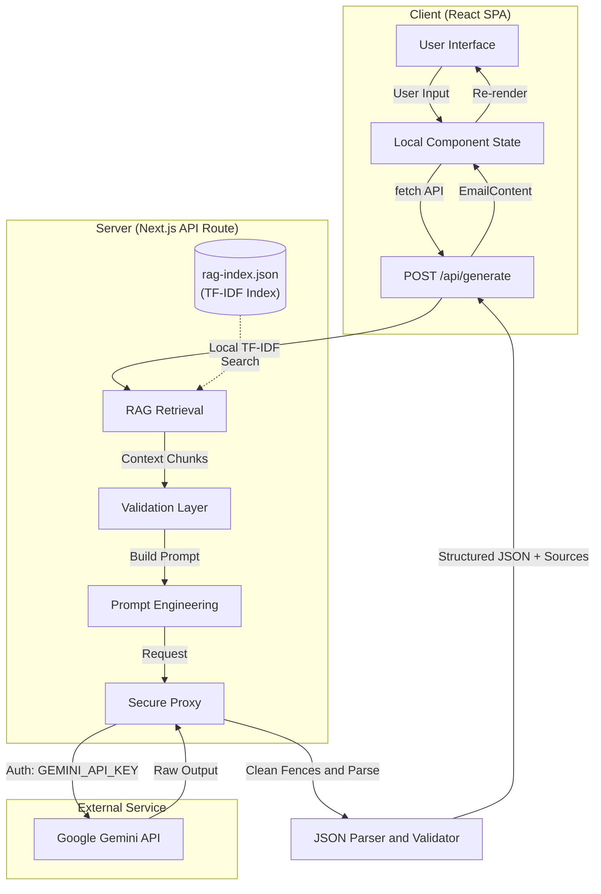

# BreezeMail AI 🍃

> A sleek, glassmorphic, AI-assisted email generator dashboard built on Next.js App Router and powered by the Google Gemini API.

BreezeMail AI (formerly PrimeMail AI) is a powerful tool that allows you to effortlessly draft professional and personalized emails. Simply describe the intent of your email, choose your desired tone, language, and length, and the AI will craft a perfectly structured email ready to be copied into your inbox.

 <!-- Update this with an actual screenshot when publishing -->

## ✨ Features

- **AI-Powered Generation:** Leverages Google's `gemini-flash-latest` model for lightning-fast, high-quality email drafts.
- **Context-Aware (RAG):** Grounds emails in curated writing best-practices using a zero-dependency, local TF-IDF vectorizer.
- **Customizable Output:** Tailor the tone (Professional, Casual, Friendly), language (English, Hinglish), and length of your emails.
- **Glassmorphism UI:** A stunning, modern translucent UI with subtle micro-interactions and dark mode support.
- **Responsive Design:** A beautiful 3-column desktop layout that elegantly stacks into a single-column view on mobile and tablet devices.
- **History Tracking:** Automatically saves your last generated emails in a session so you can easily review and copy them later.

---

## 🛠️ Full Project Tech Stack & Tech Used

BreezeMail AI is built using the latest web technologies, ensuring high performance, scalability, and an excellent developer experience.

| Layer            | Technology                                    | Version  |
|------------------|-----------------------------------------------|----------|
| UI framework     | **React**                                     | 18.3.1   |
| Meta-framework   | **Next.js (App Router)**                      | 16.2.10 (Turbopack) |
| Language         | **TypeScript**                                | ESM      |
| Styling          | **Tailwind CSS** (v4, via `@tailwindcss/postcss`)| 4.1.12   |
| Primitives       | **Radix UI** (headless) + **lucide-react** icons | 1.x / 0.487 |
| Class utilities  | `clsx`, `tailwind-merge`, `class-variance-authority` | 2.1 / 3.2 / 0.7 |
| Core AI API      | **Google Gemini API** (`gemini-flash-latest`)| v1beta   |
| Package Manager  | **npm**                                       | —        |
| Runtime          | **Node.js**                                   | Standard |
| Animations       | **Motion** & **TW Animate CSS**               | 12.x / 1.3 |

---

## 🏗️ Full Project Architecture

BreezeMail AI follows a modern **Serverless API + Client SPA** architecture pattern, fully encapsulated within the Next.js App Router framework. 

### System Overview

1. **Client (Frontend):** A React-based Single Page Application (SPA) providing a highly interactive, glassmorphic UI. It maintains state locally (`useState`), ensuring a snappy user experience without the need for global state managers like Redux.
2. **Server (Backend API):** A server-side Next.js API Route (`/api/generate`) acting as a secure proxy. It receives user inputs, constructs a prompt, and communicates with the Gemini API.
3. **External AI Service:** Google Gemini API, responsible for natural language processing and email generation.

### Architecture Diagram



### Component Hierarchy

The frontend is a modular hierarchy of React components with strict separation of concerns.

```text
<App> (Client Component - Top-level state manager)
 ├─ <BackgroundLayer />                              (Fixed background image & dark overlay)
 ├─ Wrapper (flex min-h-screen xl:h-screen)
 │   ├─ <Navbar />                                   (Logo, Theme toggle, New generation)
 │   └─ <main>                                       (3-col grid layout on desktop)
 │       ├─ <EmailInputPanel />                      (Form: description, tone/lang/length)
 │       ├─ <GeneratedEmailPanel />                  (Displays AI output, loading states, copy button)
 │       └─ <div>
 │           ├─ <HistoryPanel />                     (Shows last 5 generations)
 │           └─ <TipsPanel />                        (Static helpful tips)
 ├─ <HistoryView />                                  (Full-screen overlay for all history)
 └─ <style>                                          (Global custom scrollbar rules)
```

### Project Directory Structure

```text
BreezeMail Ai/
├── app/
│   ├── api/generate/route.ts     # Backend: Gemini API proxy & logic
│   ├── layout.tsx                # Next.js root layout, sets html/body & imports CSS
│   └── page.tsx                  # Next.js client wrapper for <App />
├── src/
│   ├── app/
│   │   ├── App.tsx               # Top-level state, view switcher, layout
│   │   ├── types.ts              # EmailContent, HistoryItem, ViewName + helpers
│   │   └── components/
│   │       ├── BackgroundLayer.tsx 
│   │       ├── Navbar.tsx
│   │       ├── EmailInputPanel.tsx 
│   │       ├── GeneratedEmailPanel.tsx 
│   │       ├── HistoryPanel.tsx 
│   │       ├── TipsPanel.tsx 
│   │       ├── HistoryView.tsx 
│   │       └── ui/               # shadcn/Radix primitives (Button, Textarea, Select, etc.)
│   └── styles/
│       ├── index.css             # Main CSS entry (Tailwind + Theme)
│       ├── fonts.css             # Google Fonts
│       ├── tailwind.css          # Tailwind config + .glass-edge component
│       └── theme.css             # CSS variables & design tokens
├── public/
│   └── Background.png            # Static assets
└── .env.local                    # Secrets (GEMINI_API_KEY)
```

---

## 🔄 Project Details: Data Flow & State Management

### 1. State Management
- **100% local component state** via `useState` / `useCallback` / `useEffect` in `App.tsx` (marked `"use client"`). No Redux, Zustand, Context, or router library is used for application state.
- **Routing** is a single `view: "dashboard" | "history"` enum in `App.tsx`; the History overlay is conditionally rendered.
- **Dark mode** is a class toggle on `document.documentElement` driven by `useEffect` watching `isDark`. No `localStorage` persistence.
- **History** is a `useState<HistoryItem[]>` prepended on each successful generation; sorted by `timestamp` in `HistoryView`.

### 2. Data Types & Contracts

**EmailContent Interface:**
```ts
interface EmailContent {
  subject: string;
  greeting: string;
  paragraphs: string[];
  bullets: string[];
  signOff: string;
}
```

**HistoryItem Interface:**
```ts
interface HistoryItem {
  id: string;
  title: string;
  time: string;
  timestamp: number;
  email: EmailContent;
}
```

### 3. API Contract: `POST /api/generate`

The core endpoint generating email drafts proxying to Gemini LLM.

**Request Body** (`application/json`)
```json
{
  "description": "string (required) - The user's brief",
  "tone": "string (optional) - e.g., 'Professional', 'Casual'",
  "language": "string (optional) - e.g., 'English', 'Hinglish'",
  "length": "string (optional) - e.g., 'Short', 'Medium'"
}
```

**Response Body** (`application/json`)
```json
{
  "email": {
    "subject": "Email Subject",
    "greeting": "Hi [Name],",
    "paragraphs": ["First paragraph...", "Second paragraph..."],
    "bullets": ["Point 1", "Point 2"],
    "signOff": "Best, AI",
    "sources": [
      {
        "id": "email-anatomy#0",
        "title": "Email Anatomy Guidelines"
      }
    ]
  }
}
```

### 4. Security & Defensive Parsing
- **Never expose `GEMINI_API_KEY` to the client.** The Next.js API route guarantees it remains on the server.
- **Input Validation:** The `description` field is validated to ensure it is a non-empty string before any external API calls are made.
- **Defensive Parsing:** LLMs are non-deterministic and occasionally wrap JSON in markdown code blocks. The parser explicitly strips these fences before attempting `JSON.parse`.
- **Structural Validation:** The parsed JSON is strictly typed and validated against the `EmailContent` interface at runtime. If the model hallucinates keys, the server catches it and returns a clean 502 error instead of crashing the frontend.

---

## 🚧 Constraints & Lessons Learned

- **Next.js Server Components vs Client Components:** Because the app is heavily stateful, almost all components in `src/app` must carry the `"use client";` directive at the top of the file to preserve interactivity (hooks and event handlers).
- **Flexbox Heights:** On desktop, achieving internal scroll inside the glass panels requires an unbroken chain of `min-h-0` and `flex-1`/`h-full` attributes extending all the way from the `xl:h-screen` root down to the scrollable container. Without it, flex children will expand to fit their content and ruin the layout.
- **LLM JSON Formatting:** Gemini sometimes ignores the instruction to omit markdown fences. A custom `stripCodeFences()` function is essential to ensure `JSON.parse` doesn't throw.
- **Timeouts:** The Gemini API can occasionally hang. The Next.js API route implements an `AbortController` with a 2-minute timeout (`TIMEOUT_MS = 120_000`) to prevent the frontend loading state from spinning indefinitely.

---

## 🚀 Getting Started / Installation

### Prerequisites
- Node.js (v18+ recommended)
- A Google Gemini API Key (Acquire from [Google AI Studio](https://aistudio.google.com/))

### Installation Steps

1. **Clone the repository:**
   ```bash
   git clone https://github.com/Abhinav2896/BreezeMail-Ai.git
   cd BreezeMail-Ai
   ```

2. **Install dependencies:**
   ```bash
   npm install
   ```

3. **Set up environment variables:**
   Create a `.env` file in the root directory for your secrets:
   ```env
   GEMINI_API_KEY=your_gemini_api_key_here
   ```
   (Optional) The RAG configuration is controlled via `.env.local`:
   ```env
   RAG_ENABLED=true
   RAG_K=3
   RAG_MIN_SCORE=0.10
   RAG_MAX_CONTEXT_CHARS=2400
   ```

4. **Build the RAG Index & run the dev server:**
   ```bash
   npm run build  # Builds the RAG index and Next.js app
   npm run dev    # Starts the dev server
   ```

5. **Open the application:**
   Navigate to [http://localhost:3000](http://localhost:3000) in your browser.

---